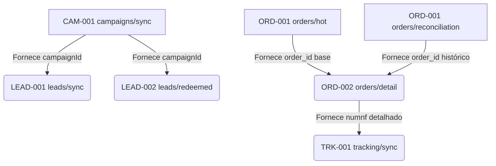

# Proposta de Políticas Operacionais de Sincronização ZEISS

**Documento Vivo — BD_API_ZEISS**
**Status:** PROPOSTA PARA APROVAÇÃO HUMANA

Este documento define os parâmetros de cadência e configurações técnicas do `sync_worker` da plataforma BD_API_ZEISS. **Nenhum valor operacional refletido aqui constitui imposição da ZEISS**; são estratégias arquiteturais conservadoras desenhadas para obter os dados de maneira eficiente sem onerar os limites de API do provedor.

---

## 1. ARQUITETURA PARA SELECTIVE_SYNC

Para operações dependentes de contexto (`orders/detail` e `tracking/sync`), existem duas vias teóricas: o engatilhamento em cadeia e o polling de descoberta.

**Recomendação: OPÇÃO A (DISCOVERY/POLLING)**
Neste modelo, o Worker desperta a cada `interval_seconds`, consulta as tabelas locais buscando entidades (pedidos) que se enquadrem nos critérios de pendência, e as processa.
**Justificativa:**
- **Isolamento de Falhas:** Se `orders/hot` quebrar ou exceder tempo de execução, `orders/detail` e `tracking/sync` não ficam travados;
- **Recuperação:** Após um *restart* ou *crash* da plataforma, os jobs identificam naturalmente o que ficou pendente olhando o estado do banco.
- **Retry Simplificado:** Permite o agendamento de retentativas exclusivas para as instâncias com falha, utilizando seus próprios limites e tempos de lock.
- **Independência:** O Worker permanece uma máquina de estados idempotente, incapaz de empilhar tarefas infinitas na memória.

---

## 2. ESTRATÉGIA DE LOOKBACK

O atributo `lookback_seconds` reflete a janela histórica requerida pelo contrato temporal da API na ZEISS. Ele garante a retroatividade adequada para recuperação de dados assíncronos.

**Onde faz sentido (Data-bound APIs):**
- `orders/hot`: Janela estrita (ex: buscar sempre as últimas 48h) para garantir cobertura mesmo em inatividade de fins de semana.
- `orders/reconciliation`: Janela profunda (ex: últimos 30 dias) para cobrir reajustes silenciosos na ZEISS.
- `financial/receivables`: Janela profunda (ex: últimos 30 dias) abrangendo faturamentos que retroagem ou vencimentos longos.

**Onde NÃO faz sentido (`lookback = NULL`):**
- `products/sync`, `campaigns/sync`: Contratos retornam dados integrais/full state.
- `orders/detail`, `tracking/sync`: Contratos orientados a entidade específica (`ID`), sem janela temporal no endpoint.
- `leads/sync`, `leads/redeemed`: Contratos orientados por campanha, não por filtro de datas explícito.

---

## 3. PROPOSTA DAS POLÍTICAS DE BASE (SEEDS)

> *Nota de Leitura:* **T (TECHNICAL)** representa valores derivados da proteção arquitetural do próprio banco (leases, lock e resiliência). **O (OPERATIONAL)** representa variáveis exclusivas de regras de negócio, frequência de atualização e janela temporal — exigindo aprovação final do mantenedor.

| PROVIDER | DOMAIN | OPERATION | API | ENABLED | INTERVAL (s) | LOOKBACK (s) | TIMEOUT (s) | LEASE TTL (s) | MAX RETRIES | RETRY DELAY (s) |
|---|---|---|---|---|---|---|---|---|---|---|
| zeiss | products | `sync` | PRD-001 | TRUE | **86400** (24h) [O] | **NULL** | **300** (5m) [T] | **600** (10m) [T] | **3** [T] | **3600** (1h) [T] |
| zeiss | campaigns | `sync` | CAM-001 | TRUE | **43200** (12h) [O] | **NULL** | **60** (1m) [T] | **120** (2m) [T] | **3** [T] | **300** (5m) [T] |
| zeiss | orders | `hot` | ORD-001 | TRUE | **900** (15m) [O] | **172800** (48h) [O] | **120** (2m) [T] | **300** (5m) [T] | **2** [T] | **120** (2m) [T] |
| zeiss | orders | `reconciliation` | ORD-001 | TRUE | **86400** (24h) [O] | **2592000** (30d) [O] | **600** (10m) [T] | **1200** (20m) [T] | **2** [T] | **3600** (1h) [T] |
| zeiss | orders | `detail` | ORD-002 | TRUE | **900** (15m) [T] | **NULL** | **300** (5m) [T] | **600** (10m) [T] | **2** [T] | **300** (5m) [T] |
| zeiss | tracking | `sync` | TRK-001 | TRUE | **3600** (1h) [O] | **NULL** | **120** (2m) [T] | **300** (5m) [T] | **2** [T] | **300** (5m) [T] |
| zeiss | leads | `sync` | LEAD-001 | TRUE | **3600** (1h) [O] | **NULL** | **120** (2m) [T] | **300** (5m) [T] | **3** [T] | **300** (5m) [T] |
| zeiss | leads | `redeemed`| LEAD-002 | TRUE | **3600** (1h) [O] | **NULL** | **120** (2m) [T] | **300** (5m) [T] | **3** [T] | **300** (5m) [T] |
| zeiss | financial | `receivables`| FIN-001 | TRUE | **21600** (6h) [O] | **2592000** (30d) [O] | **180** (3m) [T] | **600** (10m) [T] | **3** [T] | **300** (5m) [T] |

*(VCH-001, FIN-002, FIN-003 e Mutations não recebem políticas por serem rotinas externas de UI/on-demand).*

---

## 4. ESTRATÉGIAS OPERACIONAIS ESPECÍFICAS

### A. ORD-002 (Detail)
- **Estratégia Conservadora (Primeira Hidratação):** O worker buscará no banco local por IDs listados em `zeiss.orders` que ainda não possuam chave correspondente em `zeiss.order_details`.
- **Estratégia de Atualização:** Pedidos classificados como `MUTABLE` são re-hidratados. A atualização recorrente cessa quando atingem o estado `BILLED_LOGISTICS_READY` ("Faturado - Aguardando processo logístico").

### B. TRK-001 (Tracking)
- **Descoberta:** O worker procura pedidos que já possuem a chave logística mínima revelada (`numnf` não nulo).
- **Controle de Polling:** Devido à decisão *UNRESOLVED* sobre Status Terminais, sugerimos limitar a varredura a pedidos cuja idade da NF não ultrapasse 60/90 dias; evitando assim o polling cego perpétuo de pedidos arquivados no Provider. 
*(Nota: O TRK-001 possui contrato confirmado; entretanto, os últimos testes de integração depararam-se como BLOCKED pela momentânea indisponibilidade de NFs ativas e aptas ao teste logístico).*

### C. Iterações em Bloco (Leads e Vouchers)
- As operações `leads/sync` e `leads/redeemed` não possuem payload absoluto global na ZEISS; demandam iteração.
- O worker buscará os dados de `zeiss.campaigns` ativas localmente, efetuando o dispatch de chamadas da API sob demanda usando cada `campaignId`.

---

## 5. GRAFO DE DEPENDÊNCIAS DE EXECUÇÃO E DADOS

A execução encadeada técnica não existe (pois o worker utiliza DISCOVERY/POLLING), porém existe uma dependência vital lógica dos dados presentes no banco para que as rotinas subsequentes possuam subsídios à consulta.

---

## 6. UNRESOLVED DECISIONS E FATORES BLOQUEANTES

- **TRACKING_TERMINAL_STATUS = UNRESOLVED** (Falta confirmar a relação de códigos de finalização na DRIVIN para cessar as requisições ativas de TRK-001 no banco local).
- **CAMPAIGN_INACTIVE_BEHAVIOR = UNRESOLVED** (Campanhas antigas continuarão chegando pelo payload geral CAM-001 ou desaparecerão? Em qual momento exclui-se um lead inútil da memória local?).
